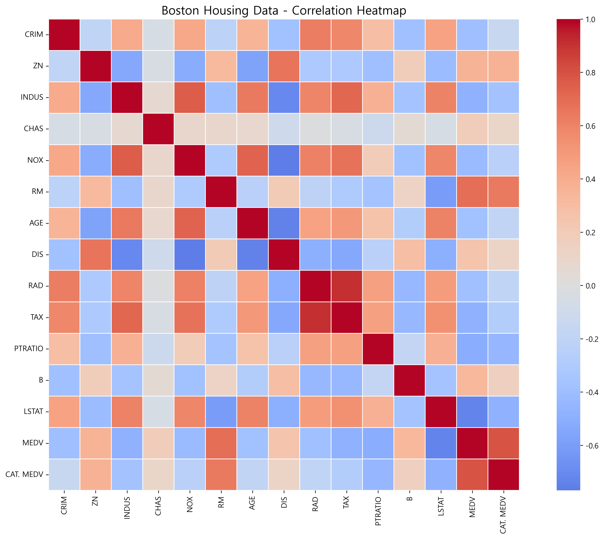
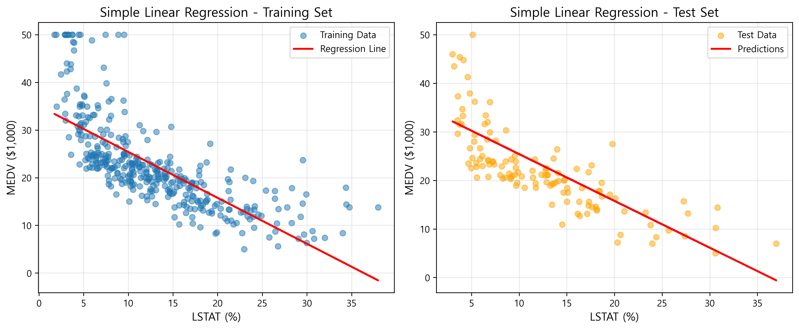
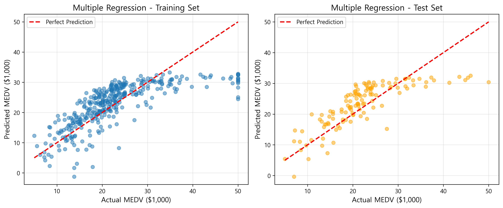
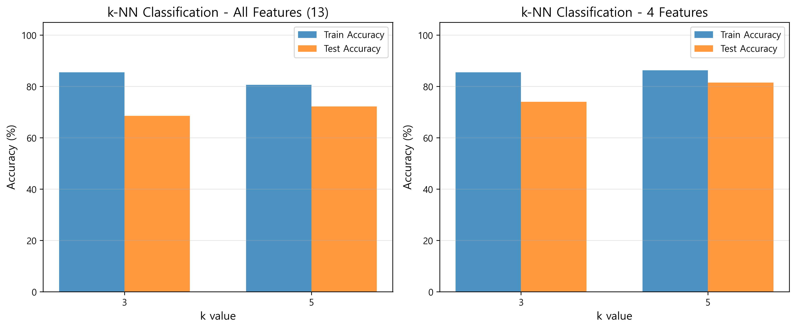

# AI+X:R-Py HOMEWORK

---

## Part 1: 보스턴 주택가격 데이터 분석

### 1. 상관관계 분석


### 2. 단순회귀분석 (LSTAT → MEDV)


- **Training R²**: 0.5444
- **Training MSE**: 38.4836
- **Test MSE**: 37.6745

### 3. 다중회귀분석 (LSTAT, TAX → MEDV)


- **Training R²**: 0.6123
- **Training MSE**: 32.7210
- **Test MSE**: 31.8952

---

## Part 2: 와인 k-NN 분류

### k값에 따른 정확도 비교


### 결과 요약

| Features | k | Train Accuracy | Test Accuracy |
|----------|---|----------------|---------------|
| 모든 특징 (13개) | 3 | 98.40% | 96.30% |
| 모든 특징 (13개) | 5 | 96.80% | 96.30% |
| 4개 특징 | 3 | 91.20% | 88.89% |
| 4개 특징 | 5 | 88.80% | 87.04% |

---

## 필요한 라이브러리
```bash
pip install numpy pandas matplotlib seaborn scikit-learn
```